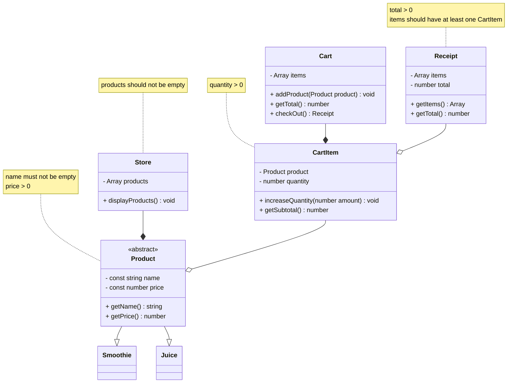

```mermaid
classDiagram

class Product{
    <<abstract>>
    - const string name 
    - const number price

    + getName() string
    + getPrice() number
    
}
note for Product"
  name must not be empty
  price > 0

"
class Smoothie{

}
 class Juice{

 }
 Product --|> Smoothie
 Product --|> Juice

class CartItem{
    - Product product
    - number quantity
    + increaseQuantity(number amount) void
    + getSubtotal() number
}
note for CartItem"
quantity > 0
"
class Cart{
    - Array<CartItem> items
    + addProduct(Product product)void
    + getTotal() number
    + checkOut() Receipt

}
 class Store{
    - Array<Product> products
    + displayProducts() void
 }
 
 note for Store"
 products should not be empty 
 "
 class Receipt{
    - Array<CartItem> items
    - number total
    + getItems() Array<CartItem>
    + getTotal() number

 }
 note for Receipt"
 total > 0
 items should have at least one CartItem
 "

 Store --* Product
 CartItem --o Product
 Cart --* CartItem
 Receipt --o CartItem

```