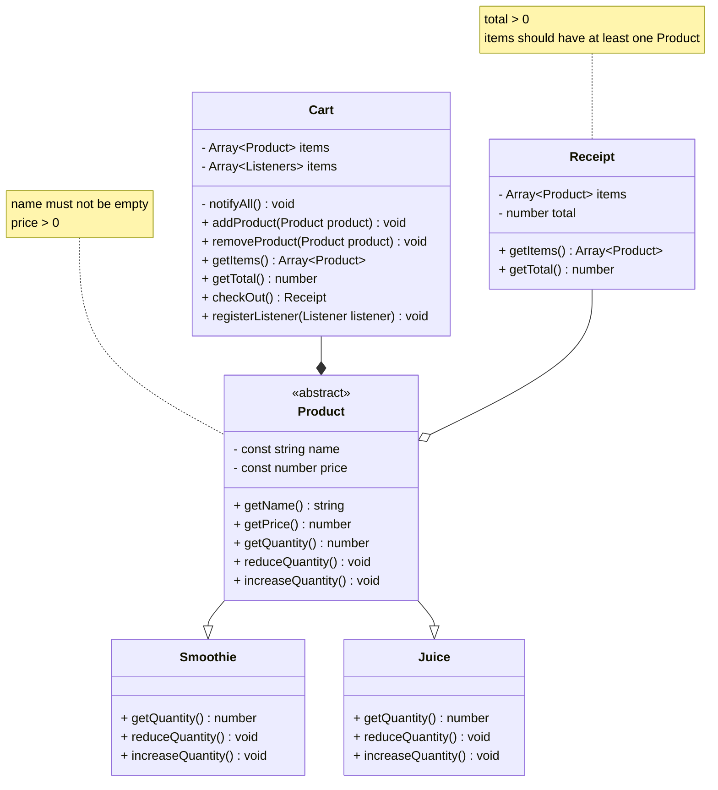

# Domain model

```mermaid
classDiagram

class Product{
    <<abstract>>
    - const string name 
    - const number price

    + getName() string
    + getPrice() number
    + getQuantity() number
    + reduceQuantity() void
    + increaseQuantity() void
    
}
note for Product"
  name must not be empty
  price > 0
"
class Smoothie{ 
    
    + getQuantity() number
    + reduceQuantity() void
    + increaseQuantity() void
}

class Juice{
  
    + getQuantity() number
    + reduceQuantity() void
    + increaseQuantity() void
 }
 Product --|> Smoothie
 Product --|> Juice


class Cart{
    - Array~Product~ items
    - Array~Listeners~ items
    - notifyAll() void
    + addProduct(Product product)void
    + removeProduct(Product product) void
    + getItems() Array~Product~
    + getTotal() number
    + checkOut() Receipt
    + registerListener(Listener listener) void

}

 class Receipt{
    - Array~Product~ items
    - number total
    + getItems() Array~Product~
    + getTotal() number

 }
 note for Receipt"
 total > 0
 items should have at least one Product
 "

 
 
 Cart --* Product
 Receipt --o Product

```