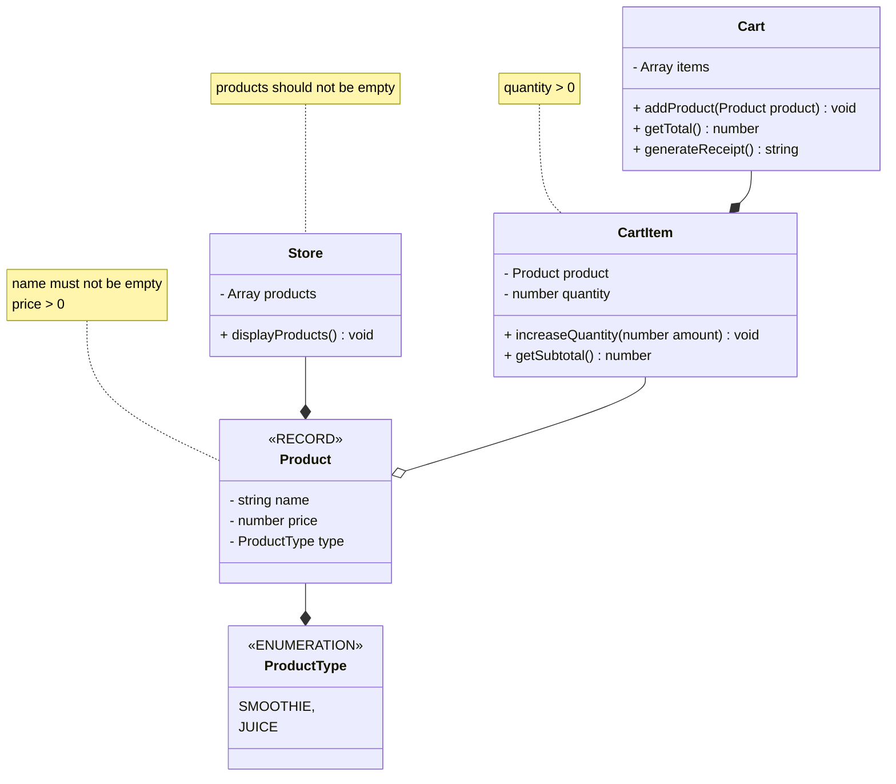

```mermaid
classDiagram
class Product{
    <<RECORD>>
    - string name 
    - number price
    - ProductType type
}
note for Product"
  name must not be empty
  price > 0

"
class ProductType{
    <<ENUMERATION>>
     SMOOTHIE,
     JUICE
    
}
class CartItem{
    - Product product
    - number quantity
    + increaseQuantity(number amount) void
    + getSubtotal() number
}
note for CartItem"
quantity > 0
"
class Cart{
    - Array<CartItem> items
    + addProduct(Product product)void
    + getTotal() number
    + generateReceipt() string

}
 class Store{
    - Array<Product> products
    + displayProducts() void
 }
 note for Store"
 products should not be empty
 "

 Product --* ProductType
 Store --* Product
 CartItem --o Product
 Cart --* CartItem

```