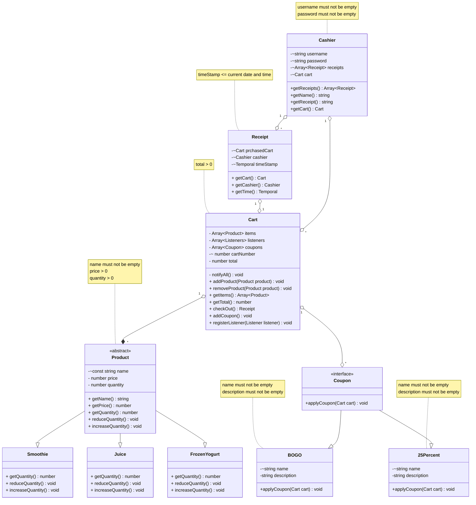

# Domain model

## Changes since phase 1
* We now have a coupon class which is an interface with two types the BOGO and the 25Percent coupons and also have cashiers who can sign in to process
  checkouts and apply coupons and generate results
* I added a quantity field to my product class to keep track of how much of each product is available
* I added a new type of product frozen yougurt which will be measured in millilitres(ml) typed in when a customer is purchasing that product
* I also added constraints where necessary to indicate uniqueness as well as bidirectional relationships
