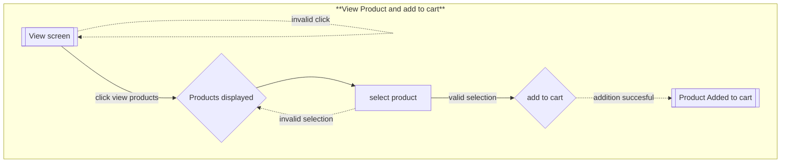
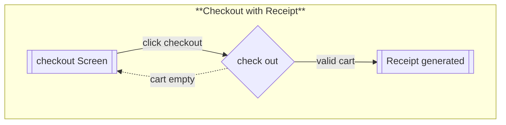

# Flows of interaction

```mermaid
flowchart
subgraph **View Product and add to cart**

Start[[View screen]]--click view products--> ProductsDisplayed{Products displayed}
Start -.invalid click.-> Start
ProductsDisplayed -->SelectProduct[select product]
SelectProduct --valid selection--> AddCart{add to cart}
SelectProduct -.invalid selection .->ProductsDisplayed
AddCart -.addition succesful.-> Done[[Product Added to cart]]

end

```

```mermaid
flowchart
subgraph **Checkout with Receipt**
CheckoutScreen[[checkout Screen]]--click checkout-->Checkout{check out}
Checkout -.cart empty .->CheckoutScreen
Checkout --valid cart-->Receipt[[Receipt generated]]

end
```