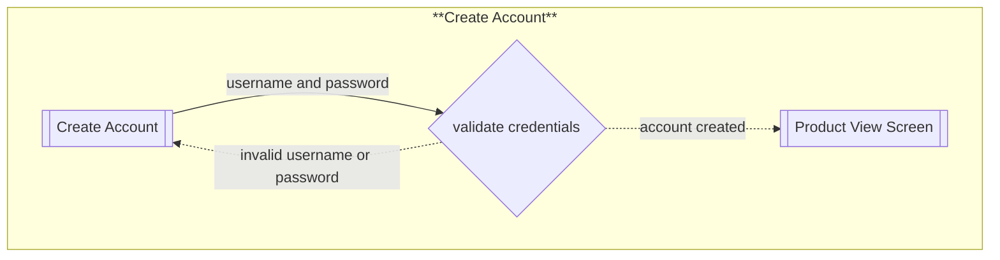
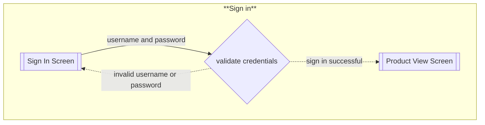
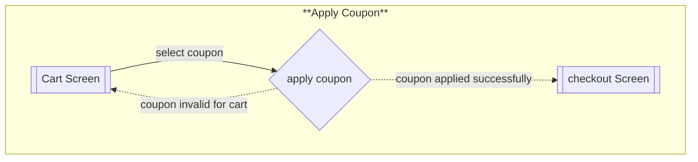
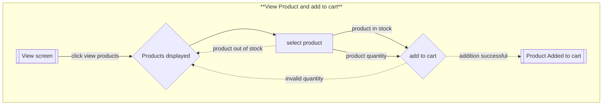
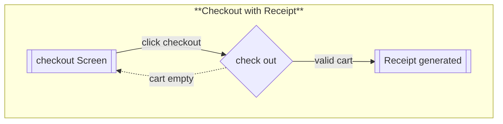

# Flows of interaction

# Flows for Phase 2
## Create Account

## Sign In

## Apply coupon

# Flows for Phase 1
## View Product and add to cart

## Checkout with receipt

### Changes
* The only initial flow I changed was in view products and add to cart where I added when a product is selected and it 
* requires a quantity to be entered after that input is gotten that quantity will be validated before addition to cart.