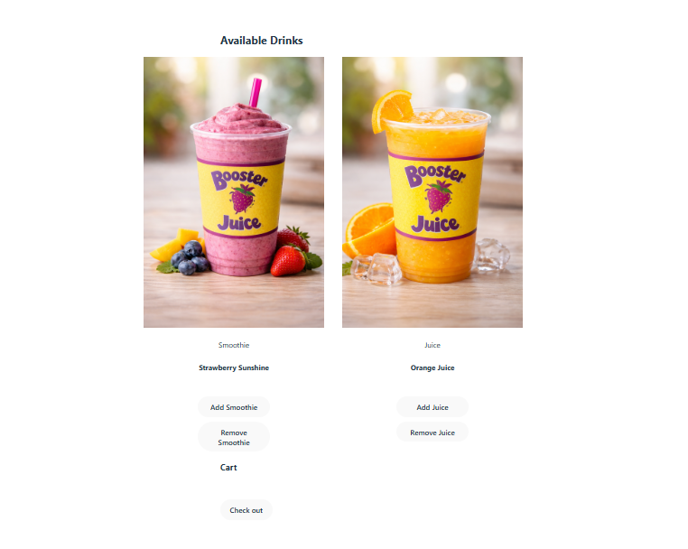
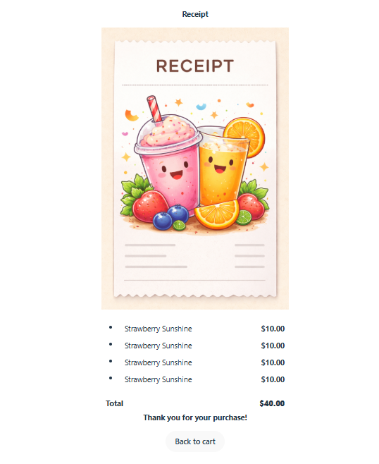
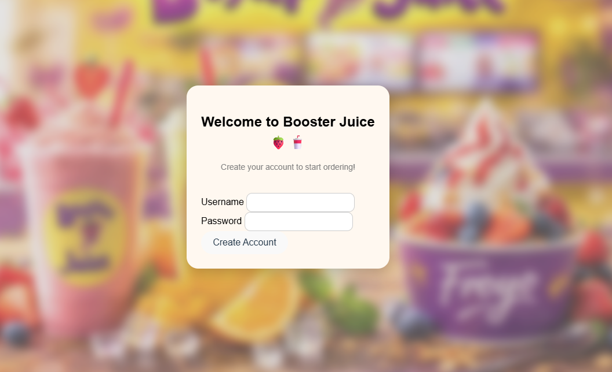
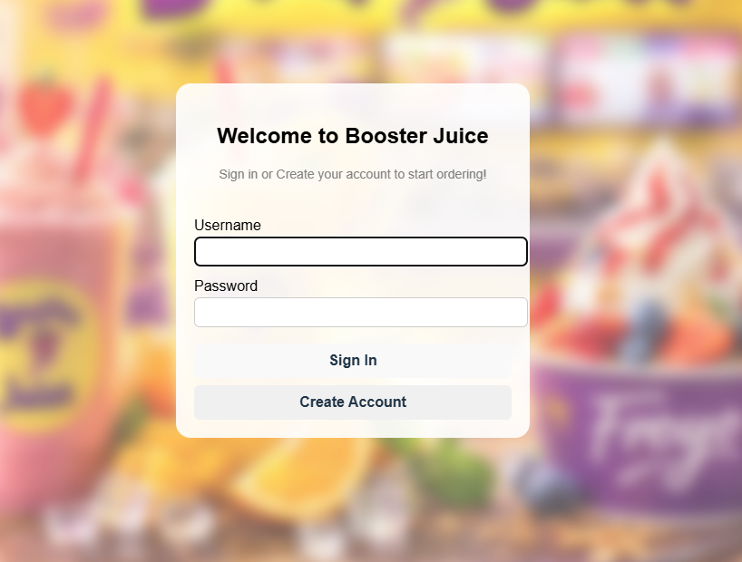
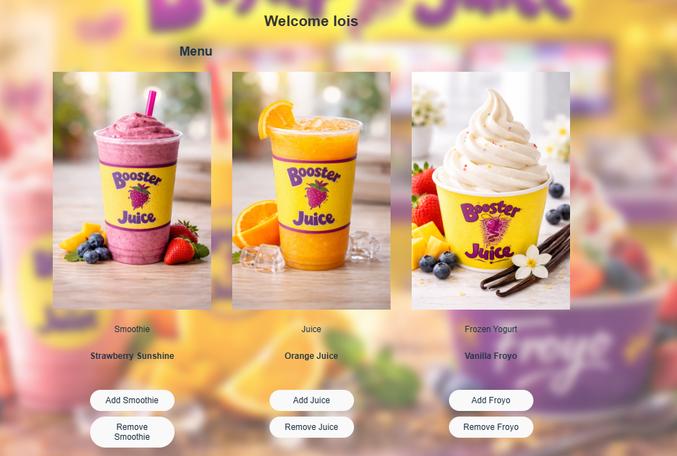
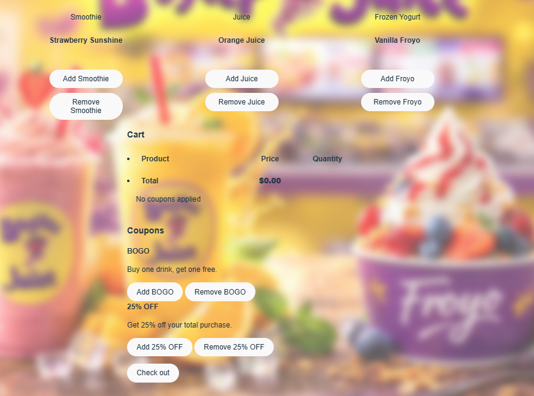
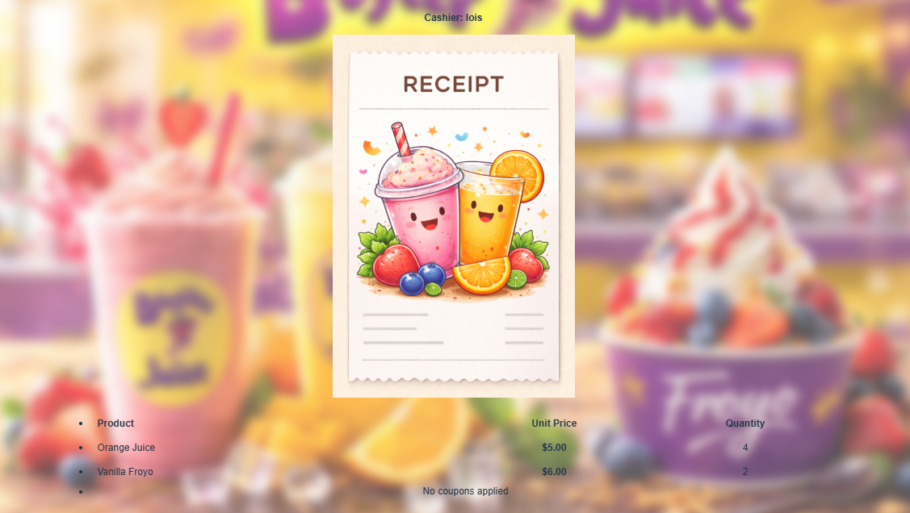
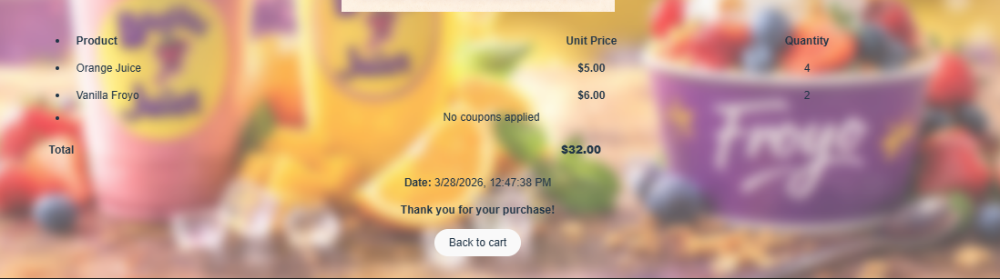

# Phase 1

Here's my UI for phase 1, it has two screens the 
add product view and the receipt view.
# Add product to cart

# Receipt View

## Phase 1 visibility
My initial implementation of this UI was quite visible because:

* :+1: All possible actions which were addition of the two types of products as well as checking out to produce a receipt were all visible!
* :+1: Also I added a navigation in receipt view to go back to cart which was disabled in cart view but enabled after receipt is generated.
* :+1: Also I would say the user knows the current state they are in based on the display of products and the cart section which shows how 
* many products are currently in the cart at any point in time as well as when checking out it is clearly stated that a receipt has been 
* created with all  the products for that transaction.

## Phase 1 feedback
My initial implementation of this UI had adequate feedback:

* :+1: Addition of products display the product added after it was added to display to the user that addition was successful and 
* also provides an error message if it was unsuccessful. 
* :+1: Removal of products display the product removed after it was removed to display to the user that removal was successful and
* also provides an error message if it was unsuccessful.  
* :+1: Check out of products display the receipt which  was successful and
* also provides an error message if it was unsuccessful.  
* :+1: Addition of products show the user the results by displaying what was added and if addition was unsuccessful displays that
*  product is out of stock hence user should try again next time.
* :-1: Removal of products show results but the error message does not tell the user how to fix the problem that is the user 
*  should add that type of product before removing them. 
* :+1: Check out shows result with receipt and the error message provided adequately tells the user to add products to cart 
* before checking out.

## Phase 1 consistency

My initial implementation of this UI had good consistency:

* :+1: All buttons in the app had appropriate labels with verbs except back to cart which is not really a verb though I
*  think it's okay(not sure of a better verb phrase).
* :+1: All inputs in the app had appropriate labels in all places.

# Phase 2

Here are the major new parts of my interface for phase 2:

# Create Account

# Sign In

Here's the main UI as I submitted it for phase 2:

# Products and Cart View

# Receipt View

## Changes from phase 1
* The main changes I made from phase 1 to phase 2 was to add  create cashier screen as well as sign in screen
* I also added coupon field to with two types of coupon ,BOGO and 25% OFF  which can be added to cart and 
* applied on checkout.

## Phase 2 visibility
My second implementation of this UI was quite visible because:

* :+1: All possible actions which were signing in,creating account, addition of the three types of products as well 
* as checking out to produce a receipt were all visible!
* :+1: Also I added a navigation in receipt view to go back to cart which was disabled in cart view but enabled after 
* receipt is generated which is the same as i did in phase 1.
* :+1: Also I would say the user knows the current state they are in based on the display of products and the cart section which shows how
* many products are currently in the cart at any point in time as well as when checking out it is clearly stated that a receipt has been
* created with all  the products for that transaction.

## Phase 2 feedback
My second implementation of this UI had adequate feedback:

* :+1: Creation of accounts displays the cashier created after it was created by displaying their name at the top to 
* show creation was successful and also provides an error message if it was unsuccessful.
* :+1: Signing in to an account displays the cashier who signed in after signing in by displaying their name at the top
* to show sign in was successful and also provides an error message if it was unsuccessful.
* :+1: Addition of products display the product added after it was added to display to the user that addition was successful and
* also provides an error message if it was unsuccessful.
* :+1: Removal of products display the product removed after it was removed to display to the user that removal was successful and
* also provides an error message if it was unsuccessful.
* :+1: Addition of coupons display the coupon added after it was added to display to the user that addition was successful and
* also provides an error message if it was unsuccessful.
* :+1: Removal of coupons display the coupon removed after it was removed to display to the user that removal was successful and
* also provides an error message if it was unsuccessful.
* :+1: Check out of products display the receipt which  was successful and
* also provides an error message if it was unsuccessful.
* :+1: Addition of products show the user the results by displaying what was added and if addition was unsuccessful displays that
*  product is out of stock hence user should try again next time.
* :-1: Removal of products show results but the error message does not tell the user how to fix the problem that is the user
*  should add that type of product before removing them.
* :+1: Check out shows result with receipt and the error message provided adequately tells the user to add products to cart
* before checking out.
* :-1: Creation of an account shows result with new cart but the error message for both username and password only tell the 
* user what is wrong but not exactly how to fix it.
* :+1: Signing in to an account shows result with new cart and the error message for both username and password  tell the
* user exactly  what is wrong but not how to fix it.
* :-1: Addition and Removal of coupons show results but the error message does not tell the user how to fix the problem that is the user
*  can not add more than one of the same type of coupon and should add that type of coupon before removing them respectively.

## Phase 2 consistency
My second implementation of this UI had good consistency:

* :+1: All buttons in the app had appropriate labels with verbs except back to cart which is not really a verb though I
*  think it's okay(not sure of a better verb phrase).
* :+1: All inputs in the app had appropriate labels in all places.
## How I might change my UI

* I would probably add make my error messages clearer to show how to fix each problem and I would change "Back to cart" 
* button to "Return to cart" just to make all buttons verbs

